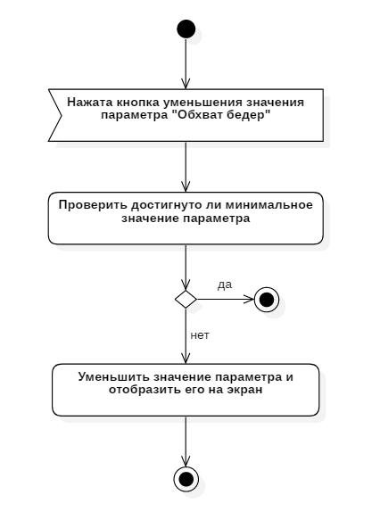

# System design (UML)

1. [Диаграмма вариантов использования](#1) 
	1.1 [Описание актеров](#1.1) 
2. [Варианты использования](#2) 
 	2.1. [Выбор пола](#2.1) 
&nbsp;&nbsp;&nbsp;&nbsp; &nbsp;2.1.1. [Поток событий](#2.1.1) 
&nbsp;&nbsp;&nbsp;&nbsp; &nbsp;2.1.2. [Диаграмма активности](#2.1.2) 
	2.2. [Изменение параметров](#2.2) 
		2.2.1 [Изменение параметра "Обхват шеи"](#2.2.1) 
		2.2.1.1 [Увеличение параметра "Обхват шеи"](#2.2.1.1) 
&nbsp;&nbsp;&nbsp;&nbsp; &nbsp;	2.2.1.1.1. [Поток событий](#2.2.1.1.1) 
&nbsp;&nbsp;&nbsp;&nbsp; &nbsp;2.2.1.1.2. [Диаграмма активности](#2.2.1.1.2.) 
		2.2.1.2 [Уменьшение параметра "Обхват шеи"](#2.2.1.2) 
&nbsp;&nbsp;&nbsp;&nbsp; &nbsp;2.2.1.2.1. [Поток событий](#2.2.1.2.1) 
&nbsp;&nbsp;&nbsp;&nbsp; &nbsp;2.2.1.2.2. [Диаграмма активности](#2.2.1.2.2.) 
		2.2.2 [Изменение параметра "Обхват груди"](#2.2.2) 
		2.2.2.1 [Увеличение параметра "Обхват груди"](#2.2.2.1) 
&nbsp;&nbsp;&nbsp;&nbsp; &nbsp;2.2.2.1.1. [Поток событий](#2.2.2.1.1) 
&nbsp;&nbsp;&nbsp;&nbsp; &nbsp;2.2.2.1.2. [Диаграмма активности](#2.2.2.1.2.) 
		2.2.2.2 [Уменьшение параметра "Обхват груди"](#2.2.2.2) 
&nbsp;&nbsp;&nbsp;&nbsp; &nbsp;2.2.2.2.1. [Поток событий](#2.2.2.2.1) 
&nbsp;&nbsp;&nbsp;&nbsp; &nbsp;2.2.2.2.2. [Диаграмма активности](#2.2.2.2.2.) 
		2.2.3 [Изменение параметра "Обхват талии"](#2.2.3) 
		2.2.3.1 [Увеличение параметра "Обхват талии"](#2.2.3.1) 
&nbsp;&nbsp;&nbsp;&nbsp; &nbsp;2.2.3.1.1. [Поток событий](#2.2.3.1.1) 
&nbsp;&nbsp;&nbsp;&nbsp; &nbsp;2.2.3.1.2. [Диаграмма активности](#2.2.3.1.2.) 
		2.2.3.2 [Уменьшение параметра "Обхват талии"](#2.2.3.2) 
&nbsp;&nbsp;&nbsp;&nbsp; &nbsp;2.2.3.2.1. [Поток событий](#2.2.3.2.1) 
&nbsp;&nbsp;&nbsp;&nbsp; &nbsp;2.2.3.2.2. [Диаграмма активности](#2.2.3.2.2.) 
		2.2.4 [Изменение параметра "Обхват бедер"](#2.2.4) 
		2.2.4.1 [Увеличение параметра "Обхват талии"](#2.2.4.1) 
&nbsp;&nbsp;&nbsp;&nbsp; &nbsp;2.2.4.1.1. [Поток событий](#2.2.4.1.1) 
&nbsp;&nbsp;&nbsp;&nbsp; &nbsp;2.2.4.1.2. [Диаграмма активности](#2.2.4.1.2.) 
		2.2.4.2 [Уменьшение параметра "Обхват талии"](#2.2.4.2) 
&nbsp;&nbsp;&nbsp;&nbsp; &nbsp;2.2.4.2.1. [Поток событий](#2.2.4.2.1) 
&nbsp;&nbsp;&nbsp;&nbsp; &nbsp;2.2.4.2.2. [Диаграмма активности](#2.2.4.2.2.) 
	2.3. [Расчет размера и типа фигуры](#2.3) 
&nbsp;&nbsp;&nbsp;&nbsp; &nbsp;2.3.1. [Поток событий](#2.3.1) 
&nbsp;&nbsp;&nbsp;&nbsp; &nbsp;2.3.2. [Диаграмма активности](#2.3.2) 
3. [Диаграмма последовательности](#3) 
4. [Диаграмма состояний](#4) 
5. [Диаграмма классов](#5) 
6. [Диаграмма развертывания](#6) 

## 1\. Диаграмма вариантов использования 

### 1.1\. Описание актеров 
<b> Актер: </b> Пользователь . 
<b> Описание: </b> Человек, который использует данное приложение. 

## 2\. Варианты использования   
Сценарии выполнения вариантов использования описаны с помощью потоков событий и отображены в виде диаграмм активности.
### 2.1\. Выбор пола 
<b> Описание: </b> Вариант использования "Выбор пола" позволяет пользователю выбрать пол для дальнейшего расчета. 
#### 2.1.1\. Поток событий 
1. Пользователь нажал кнопку выбора пола; 
2. Отображение параметров для ввода, согласно выбранному полу; 
3. Конец. 

#### 2.1.2\. Диаграмма активности 

### 2.2\. Изменение параметров 
В данном пункте описываются сценарии выполнение вариантов использования для различных параметров и способов изменения.

#### 2.2.1\. Изменение параметра "Обхват шеи"
##### 2.2.1.1\. Увеличение параметра "Обхват шеи" 
<b> Описание: </b> Вариант использования "Увеличение параметра "Обхват шеи"" позволяет пользователю увеличить значение параметра "Обхват шеи". 
#####  2.2.1.1.1\. Поток событий 
1. Пользователь нажал кнопку "+" для параметра "Обхват шеи"; 
2. Проверить, является ли текущее значение параметра максимальным. Если да, то переход к шагу 4, иначе к шагу 3; 
3. Увеличить текущее значение параметра и отобразить новое значение на экран; 
4. Конец. 
#####  2.2.1.1.2\. Диаграмма активности 

##### 2.2.1.2\. Уменьшение параметра "Обхват шеи" 
<b> Описание: </b> Вариант использования "Уменьшение параметра "Обхват шеи"" позволяет пользователю уменьшить значение параметра "Обхват шеи". 
#####  2.2.1.2.1\. Поток событий 
1. Пользователь нажал кнопку "-" для параметра "Обхват шеи"; 
2. Проверить, является ли текущее значение параметра минимальным. Если да, то переход к шагу 4, иначе к шагу 3; 
3. Уменьшить текущее значение параметра и отобразить новое значение на экран; 
4. Конец. 
##### 2.2.1.2.2\. Диаграмма активности 

#### 2.2.2\. Изменение параметра "Обхват груди"
##### 2.2.2.1\. Увеличение параметра "Обхват груди" 
<b> Описание: </b> Вариант использования "Увеличение параметра "Обхват груди"" позволяет пользователю увеличить значение параметра "Обхват груди". 
##### 2.2.2.1.1\. Поток событий 
1. Пользователь нажал кнопку "+" для параметра "Обхват груди"; 
2. Проверить, является ли текущее значение параметра максимальным. Если да, то переход к шагу 4, иначе к шагу 3; 
3. Увеличить текущее значение параметра и отобразить новое значение на экран; 
4. Конец. 
##### 2.2.2.1.2\. Диаграмма активности 

##### 2.2.2.2\. Уменьшение параметра "Обхват груди" 
<b> Описание: </b> Вариант использования "Уменьшение параметра "Обхват груди"" позволяет пользователю уменьшить значение параметра "Обхват груди". 
##### 2.2.2.2.1\. Поток событий 
1. Пользователь нажал кнопку "-" для параметра "Обхват груди"; 
2. Проверить, является ли текущее значение параметра минимальным. Если да, то переход к шагу 4, иначе к шагу 3; 
3. Уменьшить текущее значение параметра и отобразить новое значение на экран; 
4. Конец. 
##### 2.2.2.2.2\. Диаграмма активности 

#### 2.2.3\. Изменение параметра "Обхват талии"

##### 2.2.3.1\. Увеличение параметра "Обхват талии" 
<b> Описание: </b> Вариант использования "Увеличение параметра "Обхват талии"" позволяет пользователю увеличить значение параметра "Обхват талии". 
##### 2.2.3.1.1\. Поток событий 
1. Пользователь нажал кнопку "+" для параметра "Обхват талии"; 
2. Проверить, является ли текущее значение параметра максимальным. Если да, то переход к шагу 4, иначе к шагу 3; 
3. Увеличить текущее значение параметра и отобразить новое значение на экран; 
4. Конец. 
##### 2.2.3.1.2\. Диаграмма активности 

##### 2.2.3.2\. Уменьшение параметра "Обхват талии" 
<b> Описание: </b> Вариант использования "Уменьшение параметра "Обхват талии"" позволяет пользователю уменьшить значение параметра "Обхват талии". 
##### 2.2.3.2.1\. Поток событий 
1. Пользователь нажал кнопку "-" для параметра "Обхват талии"; 
2. Проверить, является ли текущее значение параметра минимальным. Если да, то переход к шагу 4, иначе к шагу 3; 
3. Уменьшить текущее значение параметра и отобразить новое значение на экран; 
4. Конец. 
##### 2.2.3.2.2\. Диаграмма активности 

#### 2.2.4\. Изменение параметра "Обхват бедер"
##### 2.2.4.1\. Увеличение параметра "Обхват бедер" 
<b> Описание: </b> Вариант использования "Увеличение параметра "Обхват бедер"" позволяет пользователю увеличить значение параметра "Обхват бедер". 
##### 2.2.4.1.1\. Поток событий 
1. Пользователь нажал кнопку "+" для параметра "Обхват бедер"; 
2. Проверить, является ли текущее значение параметра максимальным. Если да, то переход к шагу 4, иначе к шагу 3; 
3. Увеличить текущее значение параметра и отобразить новое значение на экран; 
4. Конец. 
##### 2.2.4.1.2\. Диаграмма активности 

##### 2.2.4.2\. Уменьшение параметра "Обхват бедер" 
<b> Описание: </b> Вариант использования "Уменьшение параметра "Обхват бедер"" позволяет пользователю уменьшить значение параметра "Обхват бедер". 
##### 2.2.4.2.1\. Поток событий 
1. Пользователь нажал кнопку "-" для параметра "Обхват бедер"; 
2. Проверить, является ли текущее значение параметра минимальным. Если да, то переход к шагу 4, иначе к шагу 3; 
3. Уменьшить текущее значение параметра и отобразить новое значение на экран; 
4. Конец. 
##### 2.2.4.2.2\. Диаграмма активности 

### 2.3\. Расчет парамеров 
<b> Описание: </b> Вариант использования "Расчет парамеров" отображает на экран  результат расчет размера и типа фигуры на основе параметров, введенных пользователем. 
#### 2.3.1\. Поток событий 
1. Пользователь нажал кнопку "Расчитать"; 
2. Получить текущие значения параметров и произвести расчет; 
3. Отобразить экран с результатом расчета; 
4. Конец. 

#### 2.3.2\. Диаграмма активности 

## 3\. Диаграмма последовательности 

## 4\. Диаграмма состояний 

## 5\. Диаграмма классов 

## 6\. Диаграмма развертывания 
